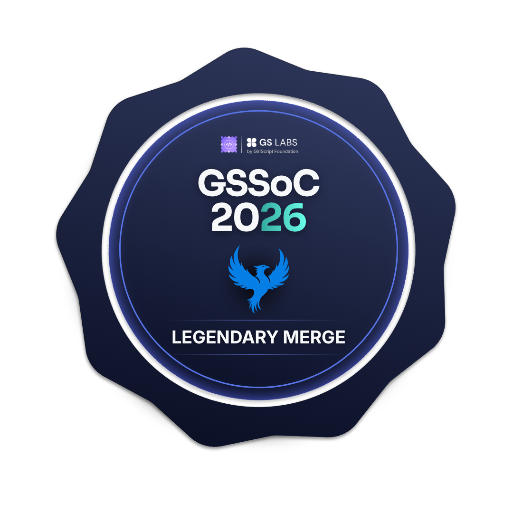

# ARSH VERMA

 

## 👨‍💻 About Me

**Frontend Developer building modern web apps & open-source tools** · Open Source Contributor 🌟

I build **clean, fast, and functional interfaces** that replace clunky workflows with seamless user experiences.

Open to **freelance projects** and **early-stage startup collaborations** in frontend and full-stack web development.

**💡 Philosophy:** If it can be built beautifully and shipped fast, it should be.

**🎯 Goal:** Become the go-to frontend engineer for products that actually ship and scale.

 

## 📄 Resume & Portfolio

 

## 🤝 Let's Connect

 

## 🛠️ Tech Stack & Tools

### 💬 Languages

### 🎨 Frontend

### ⚙️ Backend

### 🗄️ Databases

### ☁️ DevOps & Infrastructure

### 🎨 UI/UX & Design

### 🔧 Dev Tools

 

## 🏆 Coding & AI Profiles

 

## 🌍 Open Source

  

<h3 align="center">GirlScript Summer of Code 2026</h3>

  Open Source Contributor • Community Collaborator • Builder

  
  
  

  🏅 Official badges earned during <strong>GirlScript Summer of Code 2026</strong>

 

## ☕ Support My Work

  

📌 *Pinned projects below speak for themselves 👇*

